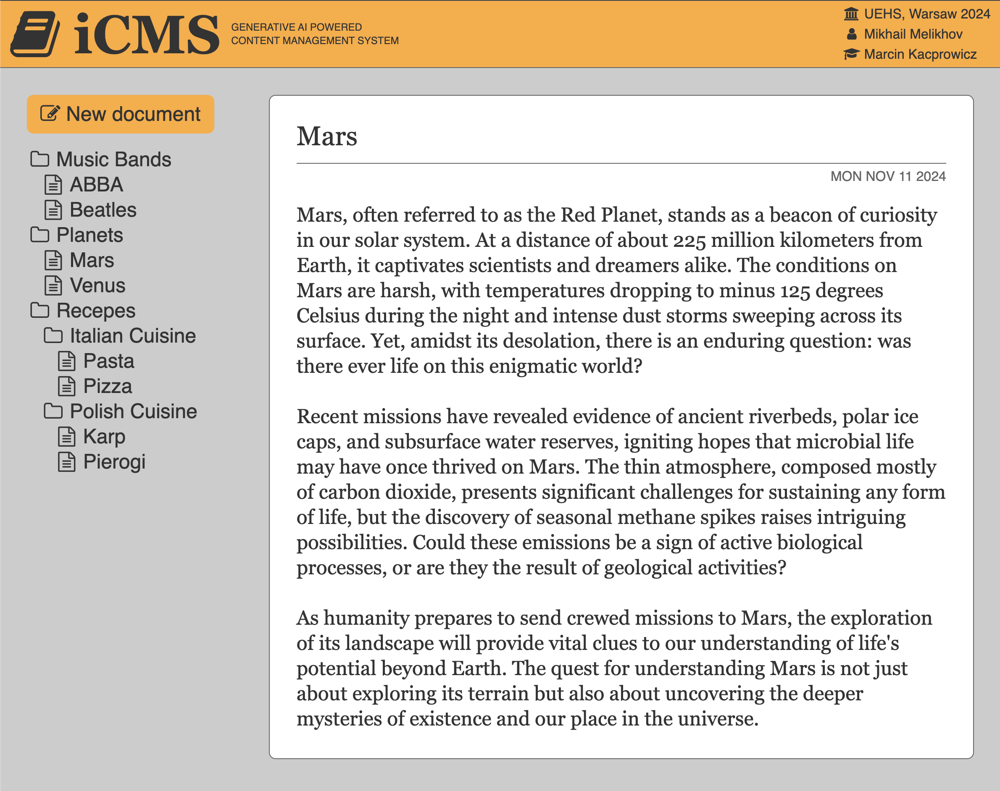

# iCMS

## Description
Generative AI powered content management system. This is an educational project showcasing automated text generation and storing it as a tree-structure.

As part of the project, I've experimented with a new techstack:

- **Deno** as a TypeScript runtime.
- **Hono** as a backend framework.
- **MongoDB Atlas** as a document storage.

Installation instructions:

1. Provide the `.env` file with following constants

| Name |Description|
| - | - |
| SERVER_HOST | Hostname e.g. 'localhost' |
| SERVER_PORT | Application listentng port, e.g. '3000' |
| OPENAI_API_KEY | OpenAI API key to be used to fetch generated content |
| MDBATLAS_DBNAME | MongoDB Atlas database name |
| MDBATLAS_URI | MongoDB Atlas connection string |

2. Run the application by executing `deno run dev`

Developed by: Mikhail Melikhov  
Supervised by: Marcin Kacprowicz
